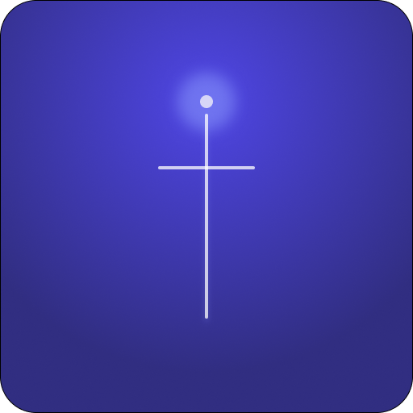

  

  # Zenith
  **A strict, telemetry-driven focus engine for deep work.**

  Zenith isn't just a timer—it's a high-performance monitor that tracks device interactions to measure the true quality of your focus. 

  
  
  
  

   

  <video src="screenshots/focus-timer-demo.mp4" width="300" autoplay loop muted></video>

   

  Current Status: Core Engine & Real-time Telemetry Mapping.

---

## The Philosophy
Standard timers are too easy to ignore. Zenith introduces **Context-Aware Friction**. It doesn't just block apps; it monitors your habits and uses telemetry to tell you how deep your focus *actually* is.

## System Architecture
Zenith is built on a **Single Source of Truth (SSOT)** principle. The UI, Service, and Persistence layers stay in perfect sync via a unidirectional data flow. This ensures that the focus session remains the absolute state, regardless of whether the application is in the foreground, background, or experiencing process death.

## Engineering Highlights

### 1. Gestural Halo Engine (Custom Canvas)
The core timer isn't built with standard components. It’s a custom-engineered **Canvas dial** that maps raw touch coordinates to trigonometric angles in real-time.
- **Performance:** Native 60fps rendering using optimized DrawScopes.
- **Interaction:** Dynamic "Snap-to-Time" logic and gestural haptics for precision control.

### 2. Resilient Lifecycle Management
To prevent the Android **Low Memory Killer (LMK)** from interrupting deep work, the timer is backed by a high-priority **Foreground Service**.
- **Survivability:** The session state is persisted across process death using a combination of Service lifecycle hooks and Room persistence.
- **Synchronization:** Real-time synchronization between the Service and UI is handled via a robust StateFlow implementation.

### 3. Focus Telemetry and Scoring
Zenith leverages the `UsageStatsManager` API to monitor physical and digital distractions without invasive app blocking:
- **Event Tracking:** Detection of app switches and physical device pickups during a sprint.
- **Algorithmic Scoring:** A custom logic engine that translates these events into a 0-100 Focus Score, providing objective data on work quality.

## Tech Stack
- **Languages:** Kotlin + Coroutines/Flow
- **UI Framework:** Jetpack Compose (Custom Canvas, Material 3)
- **Persistence:** Room (SQL with custom analytical queries)
- **Background Work:** Android Foreground Services
- **System APIs:** UsageStatsManager
- **Data Visualization:** Vico Cartesian Library

## Getting Started
1. Clone the repository.
2. Open in Android Studio (Ladybug+).
3. Connect a **physical device** (API 26+) for accurate usage telemetry.
4. Grant `Usage Access` permission in settings when prompted.

## License
Distributed under the Apache 2.0 License. See `LICENSE` for more information.

---
*Built for professionals who demand total discipline.*
