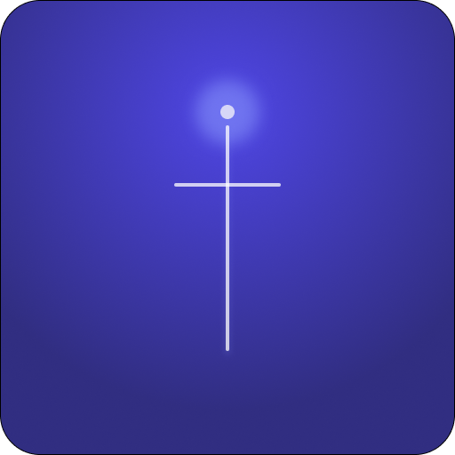
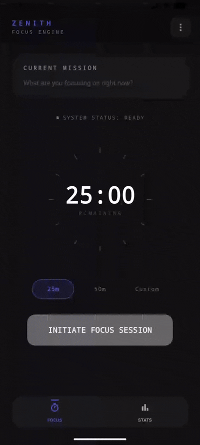

  

  # Zenith
  **A high-reliability focus enforcer designed for absolute discipline.**

  Zenith is a telemetry-driven focus engine that tracks device interactions to measure the true quality of your focus and enforces work-cycles through context-aware friction.

  
  
  
  
  

  

  Current Status: v1.0.0-beta Operational.

---

## Philosophy
Standard timers are too easy to ignore. Zenith introduces accountability through data. It monitors your habits in the background and uses real-time telemetry to penalize distractions, ensuring that deep work is a requirement, not just a goal.

## Core Features

### 1. Time Debt and The Red Arc
Distractions are not free. Zenith calculates Time Debt (2x penalty) for every second you spend on forbidden apps. This debt is visualized as a Penalty Red Arc that fills counter-clockwise, forcing you to work off the red before your mission progress resumes.

### 2. Gestural Halo Engine
A custom-engineered Canvas dial that maps raw touch coordinates to trigonometric angles.
- Native 60fps Rendering: Optimized DrawScopes for a smooth interaction.
- Smart Snap: Precision time setting with haptic feedback.

### 3. Sensory Punishment Suite
Custom-built haptic engine to snap you back to reality.
- 5 Distinct Patterns: Pulse, SOS, Rapid, and more.
- Intensity Control: Calibrate vibration strength from 1-100%.

### 4. Roast Manager Intelligence
A context-aware alert system with 100+ unique roasts categorized into Mild, Brutal, and Savage tiers. The system detects when you have picked up your phone or switched apps.

### 5. Smart Break Bank
Dynamic, percentage-based break allowances scaled to your mission length.
- Standard (10%): 6 mins/hour.
- Relaxed (20%): 12 mins/hour.
- Monk Mode: Zero breaks. Total isolation.

### 6. Whitelist Manager
Define your Safe Zones. Zenith allows you to exempt specific productivity modules (e.g., IDEs, Docs, Music) from triggering focus violations.

## Engineering Highlights

### Resilient System Architecture
Built on a Single Source of Truth (SSOT) principle. The UI, Foreground Service, and Room Persistence stay in perfect sync, ensuring zero state loss even during process death or background suspension.

### Focus Telemetry Dashboard
Real-time data visualization using the Vico Cartesian Library. Track your missions, violations, and Focus Score trends with high-fidelity charts.

### Data Privacy Protocol
Zenith operates as a Closed-Loop System. Telemetry never leaves local encrypted storage. No cloud hooks. No external tracking. Zero data leakage.

## Tech Stack
- Languages: Kotlin 2.1.0 + Coroutines/Flow
- UI: Jetpack Compose (Material 3, Custom Canvas)
- Persistence: Room (SQL with complex analytical queries)
- Engine: Android Foreground Services (Special Use type)
- Analytics: UsageStatsManager + Accelerometer Sensor Telemetry
- Animation: Android 12+ SplashScreen API

## Getting Started
1. Clone the repository.
2. Open in Android Studio (Ladybug+).
3. Connect a physical device (API 26+) for accurate usage telemetry.
4. Grant Usage Access and Notification permissions when prompted.
5. Disable battery optimization for Zenith in Engine Config to ensure the enforcer stays active.

## License
Distributed under the Apache License 2.0. See [LICENSE](LICENSE) for more information.

---

If you find this project interesting or useful for your own deep work, please consider giving this repository a star ⭐. It helps me stay motivated and helps others discover the project.

Built by Vedant Kakade for professionals who demand total discipline.
